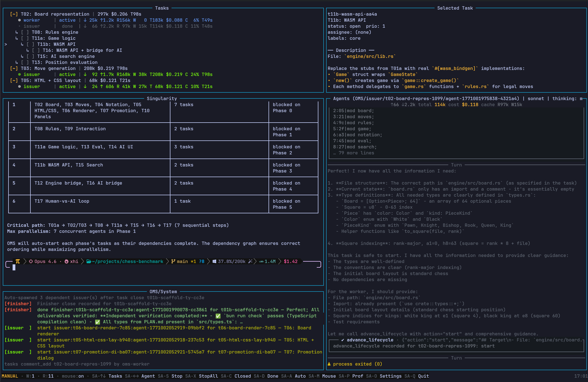

# Oh My Singularity (OMS)

A self-orchestrating multi-agent system that turns natural language requests into implemented code through an autonomous pipeline.

## What is OMS?

OMS is an orchestration layer that coordinates multiple oh-my-pi instances to implement features, fix bugs, and manage codebases autonomously. It uses an in-process task tracker and intelligent agent lifecycle management to parallelize work while preventing conflicts.

**Relationship to oh-my-pi:** OMS is built for `omp` (oh-my-pi), an agent harness/CLI; OMS coordinates them into a coherent multi-agent system.

## Benchmark



**Task:** Create a fully playable chess engine with legal move validation, AI opponent, and HTML export — built with Bun and Rust (WASM).

| Version            | Time | Quality | Notes                         |
|--------------------|------|---------|-------------------------------|
| Solo Codex (xhigh) | 2h 42m | 5/10 | Human vs human only           |
| OMS v0.0.1         | 40m | 6/10 | First orchestrated run        |
| OMS v0.0.2         | 27m | 6/10 | Improved task decomposition   |
| OMS v0.0.3         | 34m | 7/10 | Human vs AI, 39% fewer tokens |

[View v0.0.3 chess output (HTML)](media/chess-benchmark-0.0.3.html)

v0.0.3 took slightly longer wall-clock due to added AI opponent complexity, while cutting token usage nearly in half. Quality improved with Opus as the designer-worker for HTML output.

Orchestration overhead is approximately 20% for short tasks and 7% for long-running ones.

Default configuration used: Codex (xhigh) for workers, Opus (xhigh) for designer-worker, OMP default for singularity (xhigh), Sonnet (medium) for issuer/finisher/steering, 5 max concurrent workers, 15-minute steering interval.

## Problem Solved

- **Autonomous Implementation**: Natural language → task decomposition → parallel execution → completion
- **Intelligent Coordination**: Agents explore, decide, implement, and clean up without human intervention at each step
- **Conflict Prevention**: Label-based detection and IPC prevent parallel workers from clashing
- **Recovery Mechanisms**: Steering agents supervise work and redirect/interrupt when needed
- **Full Observability**: TUI shows task tree, agent activity, token/cost metrics, and system logs in real time

## Key Features

- **Pipeline Architecture**: Issuer → Worker → Finisher flow with periodic steering supervision
- **Parallel Workers**: Scheduler spawns multiple workers for independent tasks (default: 5 concurrent)
- **In-Process Task Tracker**: Full lifecycle management (create → claim → in_progress → close) via `tasks` tool API
- **Extension System**: TypeScript files inject custom tools into agent processes
- **Rich TUI**: 6-pane terminal interface with PTY-backed REPL, agent event viewer, task tree, and system logs
- **IPC Coordination**: Unix socket communication between agents and OMS for broadcasts, complaints, steering
- **Low resource usage**: updates are interrupt based and TUI rendering is simple.
---

## Architecture

### Agent Roles

- **Singularity** — User-facing coordinator. Translates requests into task issues, delegates work, broadcasts coordination messages. Read-only; never implements directly.
- **Issuer** — Pre-implementation scout. Explores the codebase and prior art, then decides *start*, *defer*, or *skip* with actionable guidance for the worker.
- **Worker** — Implements code, tests, docs for a single task. Leaves a knowledge trail via comments. Broadcasts when changes affect parallel workers.
- **Designer-Worker** — Same as worker but specialized for UI/UX/visual tasks.
- **Finisher** — Post-implementation cleanup. Reviews worker output, stops leftover agents, closes/updates issues, creates follow-ups. Owns all lifecycle mutations.
- **Steering** — Periodic supervisor. Evaluates running work and decides *continue*, *redirect*, or *interrupt*. Broadcast-steering variant evaluates multiple workers at once.

### Pipeline Flow

```
┌──────────────┐
│ Singularity  │  User request → create task issue (status: open)
└──────┬───────┘
       │
       ▼
┌──────────────┐
│   Issuer     │  Explore codebase → decide: start | defer | skip
└──────┬───────┘
       │
       ├──(start)─────────────────────────────────┐
       │                                          ▼
       │                                 ┌──────────────────┐
       │                                 │ Worker           │  Implement + comment trail
       │                                 │ or               │  (status: in_progress)
       │                                 │ Designer-Worker  │
       │                                 └──────┬───────────┘
       │                                        │
       ├──(defer)───────────────────────────────┤
       │   → status: blocked                    │
       │   → comment with reason                │
       │                                        ▼
       │                                 ┌──────────────┐
       └──(skip)────────────────────────▶│  Finisher    │  Review → close/update
                                         │              │  → stop agents
                                         └──────────────┘

        ↕ Periodic (every 15min)
┌──────────────────────┐
│ Steering             │  Evaluate workers → continue | redirect | interrupt
│ or                   │
│ Broadcast-Steering   │
└──────────────────────┘

**Resume Flow** — When tasks are in_progress but have no active agents:

┌──────────────┐
│ Resume       │  Evaluate → decide: start | defer
│ Steering     │
└──────┬───────┘
       │
       ├──(start)──▶ spawn worker (resume with context)
       │
       └──(defer)──▶ status: blocked, comment with reason
```

### Agent Lifecycle States

- **spawning** — Process starting, not yet ready
- **running** — Active, processing tool calls
- **done** — Completed successfully
- **stopped** — Manually stopped or interrupted
- **dead** — Process crashed or exited with error

### Extension System

Extensions are TypeScript files in `src/agents/extensions/` that inject custom tools into agent processes via `omp --extension <path>`.

**Examples:**
- `tasks-worker.ts` — Worker-scoped tasks API (read + comment)
- `broadcast-to-workers.ts` — Broadcast messages to relevant workers
- `complain.ts` — Report file conflicts to OMS
- `interrupt-agent.ts` — Stop a running agent (singularity/finisher only)
- `steer-agent.ts` — Manual steering control (singularity only)

Extensions export an `init(api: ExtensionAPI)` function that registers tools and hooks. See `src/agents/extensions/types.ts` for API details.

### TUI & IPC Architecture

**6-Pane Layout:**
1. **Tasks** (top-left) — Tree view of issues with status, priority, labels
2. **Task Details** (top-right) — Markdown description, dependencies, comments
3. **Singularity REPL** (middle-left) — PTY-backed natural language interface
4. **Agents** (middle-right) — Live agent event viewer (tool calls, token usage, cost)
5. **System Logs** (bottom-left) — Filtered OMS logs (`~/.oms/sessions/<project>/logs/oms-*.log`)
6. **Settings** (overlay) — Configuration viewer (toggle with `s`)

**IPC:**
- Unix socket at `~/.oms/sessions/<project>/singularity.sock`
- Agents send tool calls; OMS responds with results
- Broadcasts routed through steering to relevant workers
- Heartbeat tracking detects stuck/dead agents

**Rendering:**
- `terminal-kit` for TUI primitives (boxes, text, mouse capture)
- `bun-pty` for PTY bridge to singularity shell
- Flash animations on state changes
- Render profiling available (see `src/tui/profiler.ts`)

---

## Installation

### Prerequisites

- **Bun** 1.3+ — Runtime and package manager ([install](https://bun.sh))
- **omp CLI** — oh-my-pi agent runtime (must be in `PATH`)
- **Git repository** (optional) — Recommended for diff/merge features

### Setup
```
git clone https://github.com/DeprecatedLuke/oh-my-singularity.git
cd oh-my-singularity
bun install
# Link the 'oms' command globally (creates symlink in Bun's bin directory)
bun link
# Now you can run 'oms' from anywhere
oms
```

**What `bun link` does:**
- Creates a global symlink for the `oms` command defined in `package.json`
- Allows running `oms` from any directory instead of `bun src/index.ts`
- Useful for development and testing the CLI as an installed package
- To unlink later: `bun unlink` (from project directory) or `bun unlink -g oh-my-singularity` (from anywhere)

On first run, OMS creates:
- `~/.oms/` — Global config directory
- `~/.oms/sessions/<project>/` — ALL runtime data (tasks, logs, session artifacts, IPC socket)

---

## Usage

### Starting OMS

**TUI Mode (default):**
```bash
bun src/index.ts
# or
bun start
```

**Pipe Mode (single request, no TUI):**
```bash
bun src/index.ts --pipe "Create a new authentication module with JWT support"
```

### TUI Navigation

**Keyboard: (Shift+Alt)**
- **Arrow keys** — Navigate tasks/agents
- **S** — Stop selected agent
- **X** — Stop all agents
- **C** — Toggle closed tasks visibility
- **Q** — Exit OMS

**Mouse:**
- Click to select tasks/agents
- Scroll in any pane

### Singularity REPL

Type natural language requests in the bottom-left pane:

```
> Implement user registration endpoint with email validation
> Fix the bug where login fails on Firefox
> Refactor the database connection pool to use connection pooling
```

No slash commands — pure natural language. Singularity creates task issues and orchestrates the pipeline.

### Monitoring Agent Execution

**Agents Pane** shows:
- Agent ID, role, status (running/done/stopped/dead)
- Current tool call (e.g., `read src/auth.ts`, `edit src/login.ts`)
- Token usage: input/output/cache read/write
- Cost: cumulative USD

**System Pane** shows:
- Scheduler events (spawning workers, detecting ready tasks)
- Pipeline state changes (issuer decided start, finisher closed task)
- Errors and warnings
- Logs written to `~/.oms/sessions/<project>/logs/oms-*.log` with auto-rotation

---

## Configuration

### Config Files

Configuration precedence (later overrides earlier):
1. `~/.oms/config.json` — Global defaults
2. `.oms/config.json` — Project-specific
3. Environment variables — `OMS_*` prefixed

### Structure

```json
{
  "ompCli": "omp",
  "pollIntervalMs": 5000,
  "steeringIntervalMs": 900000,
  "maxWorkers": 5,
  "agentEventLimit": 10000,
  
  "layout": {
    "tasksHeightRatio": 0.25,
    "agentsWidthRatio": 0.45,
    "systemHeightRatio": 0.3
  },
  
  "roles": {
    "singularity": {
      "thinking": "xhigh"
    },
    "issuer": {
      "model": "sonnet",
      "thinking": "medium",
      "tools": "bash,read,grep,find,lsp,python,fetch,web_search,task"
    },
    "worker": {
      "model": "codex",
      "thinking": "xhigh",
      "tools": "bash,read,edit,write,grep,find,lsp,python,fetch,web_search,task"
    },
    "designer-worker": {
      "model": "opus",
      "thinking": "xhigh",
      "tools": "bash,read,edit,write,grep,find,lsp,python,fetch,web_search,task"
    },
    "finisher": {
      "model": "sonnet",
      "thinking": "medium",
      "tools": "bash,read,grep,find,lsp,python,fetch,web_search,task"
    },
    "steering": {
      "model": "sonnet",
      "thinking": "medium"
    }
  }
}
```

### Key Settings

- **`ompCli`** — Path to `omp` binary (default: `"omp"`)
- **`pollIntervalMs`** — Task store polling interval (default: 5000ms)
- **`steeringIntervalMs`** — Steering evaluation interval (default: 900000ms / 15min)
- **`maxWorkers`** — Max concurrent workers (default: 5)
- **`agentEventLimit`** — Rolling event buffer size per agent for TUI (default: 10000)

### Model Configuration

Model names are fuzzy-matched or explicit:
- **Fuzzy**: `"sonnet"`, `"opus"`, `"haiku"` (matched by `omp`)
- **Explicit**: `"anthropic/claude-3-5-sonnet-20241022"`, `"openai/gpt-4"`

Thinking levels: `"off" | "minimal" | "low" | "medium" | "high" | "xhigh"`

### Environment Variables

Override config via env vars:

```bash
# Agent configuration
export OMS_MODEL_WORKER=opus
export OMS_THINKING_WORKER=high
export OMS_TOOLS_WORKER="bash,read,edit,write,grep,find"

# System settings
export OMS_MAX_WORKERS=10
export OMS_STEERING_INTERVAL_MS=600000

# omp CLI path
export OMS_OMP_CLI=/usr/local/bin/omp
```

Role suffixes: `SINGULARITY`, `ISSUER`, `WORKER`, `DESIGNER_WORKER`, `FINISHER`, `STEERING`

---

## Development

### Project Structure

```
src/
├── agents/           # Agent spawning, registry, RPC wrappers
│   ├── extensions/   # Tool injection system (TypeScript files)
│   └── prompts/      # Agent system prompts (Markdown files)
├── cli/              # CLI commands and tasks maintenance
├── config/           # Config types, constants, environment loading
├── ipc/              # IPC server, handlers, types
├── loop/             # Scheduler, pipeline, steering, lifecycle handlers
├── modes/            # TUI mode vs pipe mode entry points
├── setup/            # Environment checks, extension loading, git setup
├── tasks/            # Task store client, JSON store, poller
│   └── store/        # Store implementations (JSON, SQLite)
├── tui/              # TUI app, panes, keybinds, rendering
│   ├── components/   # Reusable renderers (markdown, RPC, status bar)
│   ├── panes/        # Task tree, task details, agents, system logs
│   └── utils/        # Text formatting, sanitization, wrapping
└── utils/            # Shared utilities (logging, streams, etc.)
```

### Commands

```bash
# Development
bun start            # Launch TUI
bun run dev          # Launch TUI with hot reload

# Quality
bun check            # Biome lint + TypeScript typecheck
bun test             # Run all tests

# Formatting
bun fix              # Biome auto-fix (unsafe) + format
bun lint             # Biome lint only
bun fmt              # Biome format only
```

### Running Tests

```bash
# All tests
bun test

# Specific test file
bun test src/tasks/store/json-store.test.ts

```

### Contributing

See [`AGENTS.md`](./AGENTS.md) for code style guidelines:

- No `any` types
- ES native `#private` fields (not TypeScript `private` keyword except constructor params)
- Bun APIs over Node where available (`Bun.file()`, `Bun.write()`, `$\`...\``)
- No inline prompts (prompts live in `.md` files)
- Centralized logger (no `console.log`)
- Import static text via `import content from "./file.md" with { type: "text" }`

Before submitting:
```bash
bun check   # Must pass
bun test    # Must pass
bun fix     # Auto-fix formatting
```

---

## Key Concepts

### Task Lifecycle

```
open → claimed → in_progress → closed
```

- **open** — Ready for work; scheduler can assign
- **claimed** — Issuer evaluating (decides start/defer/skip)
- **in_progress** — Worker implementing
- **closed** — Finisher completed (with resolution comment)

Tasks have:
- **Priority** (0-4, higher = more urgent)
- **Labels** — Conflict detection (e.g., `subsystem:auth`)
- **Dependencies** — Blocks until parent tasks close
- **Comments** — Knowledge trail from agents

### Agent Lifecycle States

- **spawning** — `omp` process starting, not ready for tool calls
- **running** — Active; processing tool calls
- **done** — Completed successfully (exit code 0)
- **stopped** — Manually stopped or interrupted by steering
- **dead** — Process crashed or exited with non-zero code

Heartbeat tracking: agents must emit tool calls periodically or steering marks them as stuck.

### Pipeline Execution

1. **Singularity** creates task issue (status: `open`)
2. **Scheduler** detects ready task, spawns **issuer**
3. **Issuer** explores codebase:
   - **start** → spawns **worker**, sets status to `in_progress`
   - **defer** → leaves status `open`, adds comment with reason
   - **skip** → closes task, adds comment with justification
4. **Worker** implements changes, leaves comments (discovery, approach, completion)
5. **Worker** exits → scheduler spawns **finisher**
6. **Finisher** reviews output, closes task, stops agents

**Parallel execution:** Scheduler spawns workers for independent tasks (no conflicting labels, no dependency chain).

### Parallel Execution and Dependency Trees

OMS executes tasks in parallel when safe to do so, using dependency trees to track execution order.

**Parallel execution model:**
- The scheduler spawns multiple workers concurrently (default: 5 max)
- Tasks without dependencies or conflicting labels run in parallel
- Each worker operates independently with its own agent instance
- Workers can broadcast coordination messages when changes affect others

**Dependency tree resolution:**
- Tasks declare dependencies via `depends_on` field (references parent task IDs)
- A task only becomes ready when all its dependencies are closed
- The scheduler maintains a dependency tree to determine execution order
- Cyclic dependencies are prevented (tree structure enforced)

- View a task's dependency tree: `tasks dep_tree <task-id> --direction down`
**Scheduling behavior:**

```
Independent tasks (no deps, different labels):
  Task A ──┐
  Task B ──┼─▶ All run in parallel (up to maxWorkers)
  Task C ──┘

Sequential dependencies:
  Task A ──▶ Task B ──▶ Task C  (strict order)
  
Mixed parallelism:
  Task A ──┬──▶ Task C ──┐
           │              ├──▶ Task E
  Task B ──┴──▶ Task D ──┘
  
  A and B run in parallel
  C and D wait for A/B completion
  C and D run in parallel
  E waits for both C and D
```

**Conflict prevention:**
- Labels (e.g., `subsystem:auth`) prevent parallel work on same area
- Two tasks with overlapping labels cannot run simultaneously
- Scheduler waits until conflicting tasks complete before starting new ones

**Example dependency chain:**

```bash
# Create parent task
> Create authentication module
  → Task ID: auth-core-a1b2

# Create dependent subtasks
> Add JWT token generation (depends on auth-core-a1b2)
  → Task ID: auth-jwt-c3d4, waits for auth-core-a1b2

> Add password hashing (depends on auth-core-a1b2)
  → Task ID: auth-hash-e5f6, waits for auth-core-a1b2
  
# Execution order:
# 1. auth-core-a1b2 runs first
# 2. auth-jwt-c3d4 and auth-hash-e5f6 run in parallel after core completes
```

### Steering and Recovery

Steering runs every 15 minutes (configurable via `steeringIntervalMs`).

**Evaluation criteria:**
- Is the worker making progress?
- Are tool calls relevant to the task?
- Is the worker stuck in a loop?

**Actions:**
- **continue** — Worker is on track
- **redirect** — Send corrective guidance (via `steer_agent` tool)
- **interrupt** — Stop worker, reassign task

Singularity can manually steer via:
- `steer_agent` — Send guidance to running agent
- `interrupt_agent` — Stop agent immediately
- `replace_agent` — Stop agent and spawn replacement

### Extensions and Tools

Extensions inject custom tools into agent processes. They export:

```typescript
export function init(api: ExtensionAPI) {
  api.registerTool({
    name: "my_tool",
    description: "Does something useful",
    input_schema: { type: "object", properties: { ... } },
    async execute(params: unknown) {
      // Implementation
      return { result: "..." };
    }
  });
}
```

Extensions can:
- Register new tools
- Hook into agent lifecycle events
- Access OMS IPC for coordination

### Broadcasts and Conflict Detection

**Broadcasts:**
- Worker broadcasts when refactoring shared code (`broadcast_to_workers` tool in singularity)
- Steering routes message to relevant workers (by label, dependency, or task similarity)
- Workers see broadcasts in their message history

**Conflict detection:**
- Labels prevent parallel work on same subsystem (e.g., two workers can't both claim `subsystem:auth`)
- `complain` tool reports file conflicts (OMS spawns resolver agent)
- `wait_for_agent` blocks until specified agent completes

---

## Troubleshooting

### Common Issues

**Agent stuck in "running" state:**
- Check system pane logs (`~/.oms/sessions/<project>/logs/oms-*.log`)
- Use singularity to steer: "Evaluate worker X and redirect if stuck"
- Manual interrupt: "Interrupt agent Y and reassign task Z"

**Socket errors on startup:**
```
Error: EADDRINUSE: address already in use /home/user/.oms/sessions/.../singularity.sock
```
- Stale socket from previous session
- Remove manually: `rm ~/.oms/sessions/*/singularity.sock`
- Or restart OMS (it cleans up on graceful exit)


**omp not found:**
```
Error: Command not found: omp
```
- Install oh-my-pi and ensure `omp` is in `PATH`
- Or set `ompCli` in config: `{ "ompCli": "/usr/local/bin/omp" }`
- Verify: `which omp` should return path

**Task stuck in "in_progress":**
- Worker crashed without finisher cleanup
- Scheduler auto-resumes on restart (spawns new issuer)
- Or ask singularity: "Recover task X" / "Unstick task X"

### Debugging Tips

**Enable detailed logging:**
- Check `~/.oms/sessions/<project>/logs/oms-*.log` for full event history
- Logs auto-rotate on size limit
- No separate debug mode (all events logged)

**Agent event inspection:**
- Agents pane shows tool calls in real time
- Click agent to see full event history
- Token usage and cost tracked per agent

**Task store inspection:**
- Read-only: `~/.oms/sessions/<project>/tasks/<issue-id>.json` (one file per task)
- Do NOT edit manually (corrupts store)
- Use `tasks` tool API or maintenance CLI

**Render profiling:**
- See `src/tui/profiler.ts` for render timing
- TUI shows frame time in status bar (if enabled)
- High frame time? Check system logs for bottlenecks

### Log Locations

- **OMS logs:** `~/.oms/sessions/<project>/logs/oms-*.log` (current session)
- **Agent logs:** Embedded in OMS logs (tagged by agent ID)
- **Task store:** `~/.oms/sessions/<project>/tasks/<issue-id>.json` (one file per task)

---

## Contributing

By contributing to this project, you agree to the terms in [CLA.md](CLA.md).

See [NOTICE](NOTICE) for information about third-party code and attributions.

## License

GPLv3. See [LICENSE](./LICENSE) for full text.

## Acknowledgments

Built on top of [oh-my-pi](https://github.com/can1357/oh-my-pi) agent runtime.
